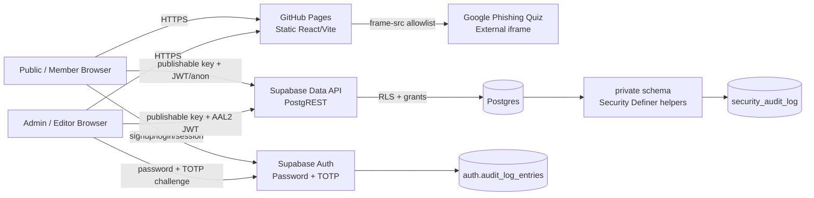

# Cảnh Giác Số — Threat Model

## Scope

This threat model covers the public Cảnh Giác Số web application, its GitHub Pages delivery path, Supabase Auth/Data API/Postgres backend, content-management functions, and the embedded Google phishing quiz. It supports the OWASP ASVS Level 2 security baseline.

## Security objectives

1. Public users can read published educational content without gaining access to drafts, management data, or other users' records.
2. A signed-in member can access only their own profile, progress, attempts, certificates, and game history.
3. Editor and Admin capabilities require a live session and TOTP MFA at AAL2.
4. Only Admin can publish content or change management roles.
5. Browser-delivered code must never contain Supabase secret/service-role credentials.
6. Privileged changes must be attributable through audit records.
7. Automated abuse of public and privileged RPCs must be throttled.

## Data-flow diagram

## Trust boundaries

### TB1 — Internet → GitHub Pages

Untrusted browsers receive static HTML/JS/CSS. No server-side trust is granted by loading the UI. Any JavaScript or DOM state can be modified by the user.

Controls: CSP, HTTPS, no browser secret keys, input encoding/validation.

### TB2 — Browser → Supabase Auth

Credentials and TOTP codes cross from an untrusted browser into Supabase Auth. Authentication status in the UI is not authorization evidence by itself.

Controls: Supabase password hashing/rate limits, TOTP MFA, JWT AAL claim, session validation, auth audit logs.

### TB3 — Browser → Supabase Data API

All request bodies, JWTs, RPC parameters, filters, and identifiers are untrusted. The publishable key identifies the application but is not an authorization credential.

Controls: explicit grants, RLS, SECURITY INVOKER public RPC wrappers, private SECURITY DEFINER helpers with empty `search_path`, Data API pre-request rate limiting.

### TB4 — Public schema → private schema

The private schema contains privileged role membership, audit records, internal history/certificates, rate-limit state, and privileged helper functions. It must not be exposed directly to anonymous users.

Controls: schema/function grants, private schema placement, AAL2 checks, live-session checks.

### TB5 — Application → external iframe

The Google phishing quiz is a different security origin. The application does not trust or expose Supabase credentials to the iframe.

Controls: CSP `frame-src` allowlist and browser same-origin isolation.

## Assets

| Asset | Sensitivity | Security requirement |
|---|---|---|
| Auth credentials / refresh tokens | High | Never logged or embedded in content; MFA for privileged roles |
| Admin/editor role assignments | High | Admin-only, AAL2, audited |
| Published/draft content | Medium/High | Draft editor/admin only; publish admin-only |
| User profiles/progress/attempts | Personal | Owner-only RLS |
| Audit trail | High | Append-only to application roles |
| Supabase publishable key | Public | Safe in browser, never treated as a secret |
| Supabase secret/service-role credentials | Critical | Must never enter browser/repository |

## STRIDE analysis

| Threat | Example | Impact | Primary mitigations |
|---|---|---|---|
| Spoofing | Stolen editor password | Unauthorized content changes | TOTP MFA; AAL2 DB enforcement; live-session check |
| Tampering | Member modifies another user's progress | Integrity breach | Owner-bound RLS; negative authorization tests |
| Repudiation | Admin denies changing a role | Audit gap | Supabase auth audit logs + private security audit log |
| Information disclosure | Guest reads draft/correct answers | Training/data exposure | Published-only RLS/RPCs; private helpers; response shaping |
| Denial of service | Bot floods guest-choice RPC | Resource exhaustion | Per-IP Data API rate limits; Auth built-in rate limits |
| Elevation of privilege | Editor calls publish/role-change RPC directly | Admin takeover | Server-side admin checks; AAL2; explicit execute grants |

## Abuse cases

### AC-01 Direct RPC privilege escalation

An attacker ignores the UI and invokes `save_managed_site_content` or `set_content_manager_role` directly.

Expected result: anonymous/member requests are denied; editor can save draft only; publishing/role changes require Admin + AAL2.

### AC-02 Horizontal IDOR

User A queries or mutates User B's profile/progress/attempts by supplying User B's UUID.

Expected result: RLS denies access because `auth.uid()` must equal the record owner.

### AC-03 Session replay after sign-out

A stolen access token is replayed after the corresponding Supabase session is removed.

Expected result: privileged helpers validate JWT `session_id` against `auth.sessions` and deny privileged access.

### AC-04 Password-only privileged login

An Admin or Editor signs in successfully with password only and navigates directly to `#/admin`.

Expected result: the application prompts for TOTP enrollment/challenge and privileged DB helpers deny operations until JWT `aal=aal2`.

### AC-05 Automated guest-RPC harvesting

A bot calls `evaluate_guest_choice` repeatedly to scrape outcomes or consume resources.

Expected result: Data API pre-request control returns HTTP 429 after the configured per-IP window.

### AC-06 XSS attempts through News rich text

An Editor attempts to persist scriptable nodes/URLs.

Expected result: the rich-text allowlist rejects unsupported nodes and non-HTTPS links; React rendering avoids raw HTML injection.

### AC-07 Supply-chain compromise

A vulnerable dependency or malicious source change reaches production.

Expected result: frozen lockfile, dependency audit, secret scan, CodeQL, OSV, SBOM, tests and build gates run before merge/deploy.

## Residual risks / infrastructure dependencies

1. GitHub Pages cannot set the complete security response-header baseline required for a mature ASVS deployment. Full CSP response headers, `frame-ancestors`, HSTS, `X-Content-Type-Options`, and Permissions-Policy require a header-capable CDN/reverse proxy/hosting layer.
2. Existing application styling still relies on inline style attributes, so removing `style-src 'unsafe-inline'` requires a dedicated frontend refactor.
3. Supabase Leaked Password Protection requires Pro Plan or above.
4. Supabase Auth CAPTCHA requires a configured hCaptcha or Cloudflare Turnstile provider and secret; built-in Auth rate limiting remains active without it.

## Review triggers

Update this model when any of the following changes occur:

- a new authentication provider or passkey/SSO flow is introduced;
- file upload/storage is added;
- server-side URL fetching or preview generation is added;
- a new public RPC/API is exposed;
- the application moves away from GitHub Pages;
- payment, financial, or other sensitive personal data is introduced;
- privileged role semantics change.
